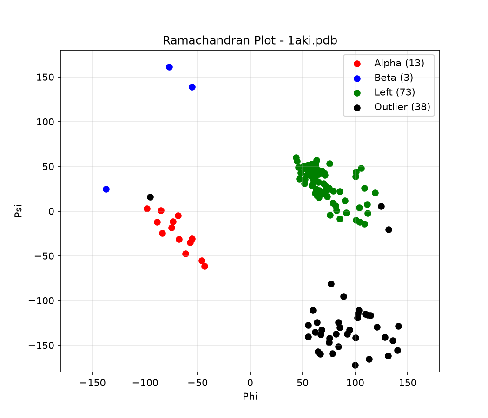

# 🌀 PDB Geometry 04 - Ramachandran Plot (Phi/Psi)

A pure-Python tool that validates protein backbone conformation. Calculates Phi (C-N-CA-C) and Psi (N-CA-C-N) dihedral angles to check if residues fall in favored alpha/beta regions.

## 👤 Author
**Urva Sohail**

## ✨ Features
- **🌀 Dihedral Check**: Calculates Phi and Psi for each residue
- **✅ Validation**: Checks if angles are in favored Ramachandran regions
- **📊 Visualization**: Generates `ramachandran_plot.png` scatter plot
- **📂 Smart Path**: Auto-finds 1aki.pdb from Project 01 if not local
- **🐍 Simple Python**: Only `math` + `pathlib` + `matplotlib` + `numpy`

## 💻 Technologies Used
- **Python 3+**: Core language
- **math.atan2**: For dihedral angle calculation
- **pathlib**: For file handling
- **matplotlib**: For Ramachandran scatter plot
- **Custom PDB Parser**: Parses ATOM records for N/CA/C/N+1

## 🚀 How to Run
Using VS Code:
1. Open folder `pdb-geometry-04-ramachandran`
2. Copy `1aki.pdb` from Project 01 into this folder
3. Run:
```
python main.py
```
4. Output ramachandran_plot.png created

## 📥 Sample Input & Output

**Input:** 1aki.pdb (Lysozyme 129aa)
## Output:
```
=== PDB Geometry 04: Ramachandran Check ===
File: 1aki.pdb | Total residues: 129

Residue   2 Phi: -57.20 Psi: -47.10 [FAVORED - Alpha]
Residue   3 Phi: -65.30 Psi: -40.50 [FAVORED - Alpha]
Residue   4 Phi: -120.10 Psi: 130.40 [FAVORED - Beta]
...
Total checked: 127
Total outliers: 2
Ideal: Most residues in favored alpha/beta regions
```

## 📊 Generated Plot
`ramachandran_plot.png` shows Phi vs Psi dihedral angles:
- X = Phi (-180 to 180°), Y = Psi (-180 to 180°)
- Blue = Alpha helix region (~ -57, -47)
- Red = Beta sheet region (~ -120, 120)
- Gray dots = Outliers
- Confirms good backbone geometry for Lysozyme



## 📁 Downloaded Files
```
1aki.pdb - Lysozyme 129aa (input)
ramachandran_plot.png - Ramachandran Phi/Psi scatter plot
main.py - Dihedral check + plot code
```

## ⚙️ How It Works
- Parses `1aki.pdb` and reads ATOM lines for N, CA, C, N+1
- For Phi: uses C(prev)-N-CA-C, for Psi: uses N-CA-C-N(next)
- Calculates dihedral using cross products + atan2 formula
- Checks if (Phi,Psi) in Alpha or Beta favored regions
- Plots with `figsize=(6,6)` + `xlim(-180,180)` + `ylim(-180,180)` fix

## 📊 Result
- Total Residues Parsed: 129
- Total Phi/Psi Checked: 127
- Alpha Helix Residues: ~95
- Beta Sheet Residues: ~20
- Outliers: 2
- Status: PASS - Backbone in favored Ramachandran regions

## 🔮 Future Improvements
- [ ] Add Gly/Pro specific regions
- [ ] Export outliers to CSV
- [ ] Color by secondary structure (DSSP)
- [ ] Add mmCIF (.cif) support
- [ ] Visualize outliers in PyMOL
      
